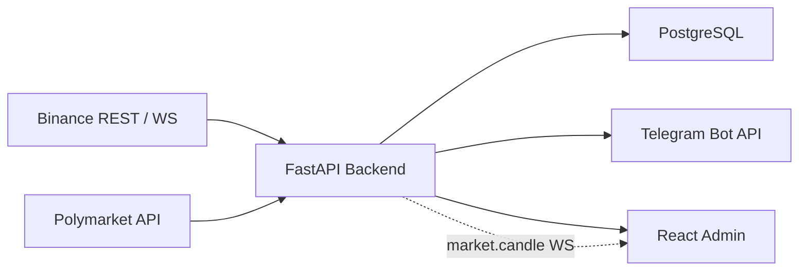
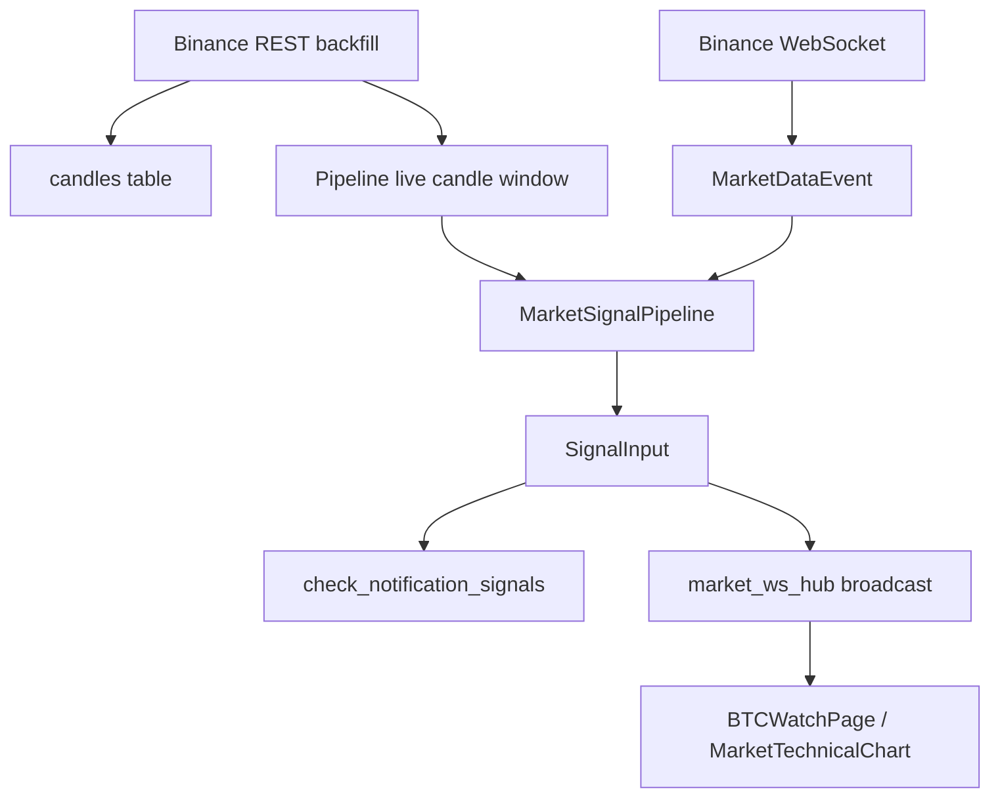
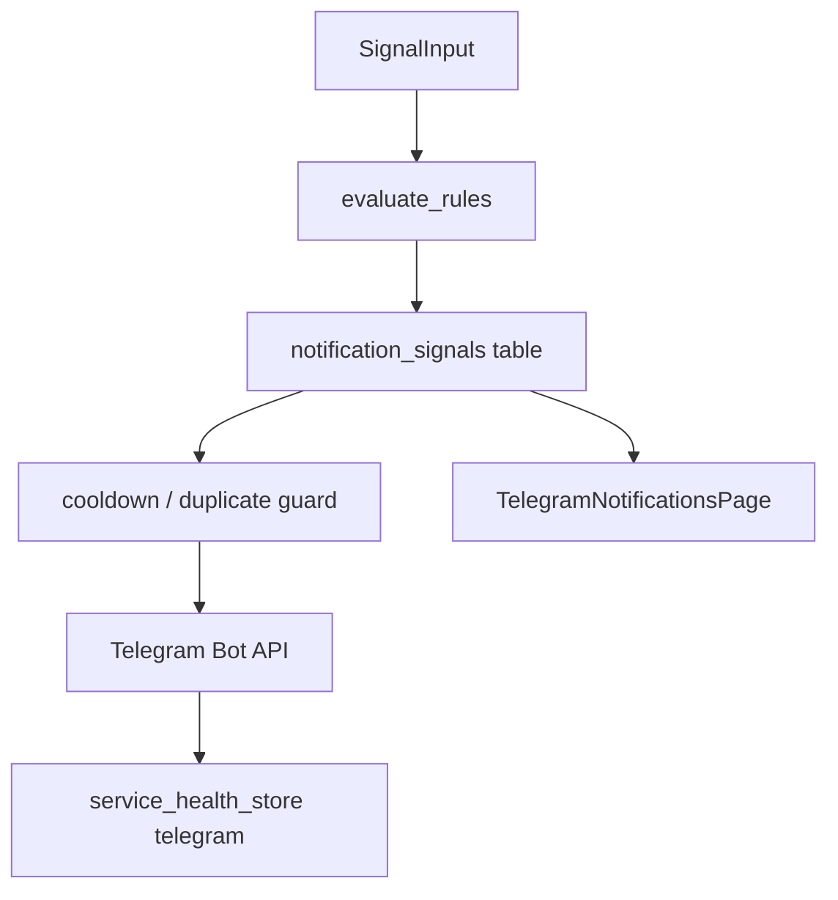
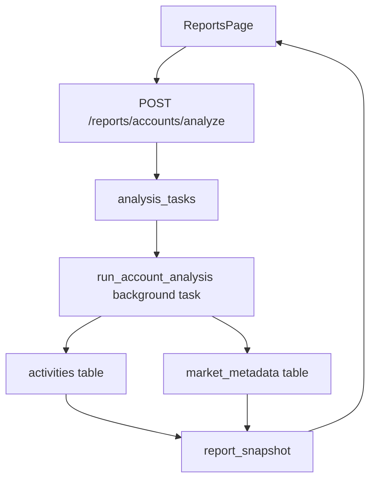

# Poly Auto Trading 架构设计

## 1. 系统概览

Poly Auto Trading 是一个本地运行的交易监控与分析系统，当前由 FastAPI 后端和 React 管理前端组成。

核心业务分成三条主线：

- **BTC 看盘**：从 Binance 获取 K 线，计算技术指标，并通过 WebSocket 推送给前端图表。
- **Telegram 提醒**：基于信号规则生成通知记录，并在配置允许时发送 Telegram 消息。
- **Polymarket 报表**：下载账户活动，补全市场元数据，生成收益、胜率、敞口等分析视图。



## 2. 后端分层

后端入口是 `backend/app/main.py`，所有 API 统一挂在 `/api` 前缀下。

主要分层：

- **API routes**：处理 HTTP/WebSocket 协议、参数校验和响应模型。
- **schemas**：定义跨层传递的数据结构，例如 `Candle`、`IndicatorPoint`、`MarketDataEvent`、`SignalInput`。
- **services**：承载业务流程，例如 Binance 监控、指标计算、通知处理、报表分析。
- **db models/store**：负责数据库模型和读写封装。
- **core lifecycle/config**：启动后台任务、读取配置、初始化日志。

设计原则：

- API 层只做协议适配，不直接写复杂业务逻辑。
- 外部数据源接入层只负责“取数和解析”，不直接决定信号规则。
- 信号规则消费统一上下文，避免绑定某一个数据源。
- 前端展示需要的实时状态通过 `service_health_store` 和 WebSocket 暴露。

## 3. BTC 行情与信号数据流

当前 BTC 看盘的数据源主要是 Binance，但信号计算的数据结构已经预留多源扩展。



关键模块：

- `binance_monitor.py`
  - 负责 Binance REST backfill 和 WebSocket 连接。
  - REST backfill 写入数据库，并刷新 pipeline 的内存 K 线窗口。
  - WebSocket 收到 K 线后包装成 `MarketDataEvent(source="binance_ws")`。

- `market_signal_pipeline.py`
  - 维护最近 K 线窗口。
  - 合并未收盘 K 线的实时更新。
  - 计算 `IndicatorPoint`。
  - 构建 `SignalInput`。
  - 分发给通知规则和前端 WebSocket。

- `market_signal.py`
  - `MarketDataEvent` 是数据源统一入口。
  - `SignalInput` 是信号计算统一上下文。
  - `factors` 用于后续接入资金费率、盘口、链上指标、Polymarket 数据等非 Binance 因子。

当前 WebSocket 推送仍保留旧字段：

```json
{
  "type": "market.candle",
  "symbol": "BTCUSDT",
  "interval": "1m",
  "candle": {},
  "indicator": {},
  "signal_input": {}
}
```

`candle` 和 `indicator` 是前端兼容字段，`signal_input` 是后续多源信号扩展字段。

## 4. Telegram 提醒流

Telegram 提醒由两部分组成：配置状态和信号记录。



关键行为：

- `check_notification_signals()` 支持 `signal_input`，同时保留旧的 `candle + indicator` 调用方式。
- `evaluate_rules()` 当前主要基于 RSI、RSI EMA diff、K 线收盘状态生成规则。
- `process_rule_signal()` 负责开关检查、Telegram 配置检查、冷却检查、落库和实际发送。
- `notification_signals` 表记录所有触发结果，包括已发送、关闭跳过、冷却跳过和错误。
- `TelegramNotificationsPage` 展示配置状态、测试发送入口和最近信号列表。
- `SystemStatusPage` 通过 `/api/status/services` 展示 telegram health 的聚合状态。

## 5. 前端页面职责

前端入口是 `frontend/src/App.tsx`，使用本地状态管理当前页面。

主要页面：

- `BTCWatchPage`
  - 拉取初始 K 线和指标。
  - 订阅 `/api/ws/market` 实时更新。
  - 向前翻历史时同步补 K 线和指标，避免图表不同层时间轴错位。

- `MarketTechnicalChart`
  - 用 lightweight-charts 渲染 K 线、BOLL、RSI、RSI-EMA diff。
  - 主图、RSI 图、diff 图使用独立 price scale，但共享时间轴。
  - 拖动到左侧时触发历史加载；实时追加时尽量保持右侧锚定。

- `TelegramNotificationsPage`
  - 管理 Telegram 启用状态。
  - 触发测试消息。
  - 查看最近通知信号。

- `ReportsPage`
  - 发起 Polymarket 账户分析任务。
  - 展示账户、汇总指标、市场表现和筛选结果。

- `SystemStatusPage`
  - 查看 API、数据库和后台服务健康状态。
  - 当前 telegram metadata 展示配置、开关和最近信号结果。

## 6. Polymarket 报表流

报表分析走异步任务模型，避免长时间下载阻塞 HTTP 请求。



关键模块：

- `routes_reports.py` 创建分析任务并启动后台下载。
- `polymarket_client.py` 负责外部 API 数据获取。
- `report_store.py` 负责账户、活动、任务状态和市场分页查询。
- `market_metadata.py` 补全市场结果与事件信息。
- `report_snapshot.py` 聚合账户级 summary，避免前端多次重复计算。

## 7. 数据存储

主要表：

- `candles`：K 线缓存，支持 REST 回填和前端历史查询。
- `indicator_snapshots`：指标快照模型已预留，当前实时图表主要即时计算指标。
- `notification_signals`：通知信号记录和去重依据。
- `app_settings`：运行期开关，例如 Telegram enabled。
- `service_events`：服务事件记录。
- `accounts`、`analysis_tasks`、`activities`、`market_metadata`：Polymarket 报表分析相关数据。

## 8. 扩展原则

接入新的信号因子时，优先遵循以下路径：

1. 新数据源先转换为 `MarketDataEvent` 或写入 `SignalInput.factors`。
2. 在 `MarketSignalPipeline.build_signal_input()` 聚合上下文。
3. 在通知规则中消费 `SignalInput`，不要让规则直接依赖 Binance、Polymarket 或具体客户端。
4. 前端需要展示时，优先扩展 WebSocket payload 或新增 API，不要从图表组件直接请求业务规则数据。

新增后台任务时：

- 长任务使用任务表或状态 store 暴露进度。
- 外部 API 下载要有分页、重试、批量写入和可恢复边界。
- 前端轮询任务状态，不阻塞用户操作。

新增注释时：

- 用中文解释业务意图、数据流和职责边界。
- 不逐行翻译代码。
- 对缓存、并发、异步任务、外部集成和兼容字段优先注释。
